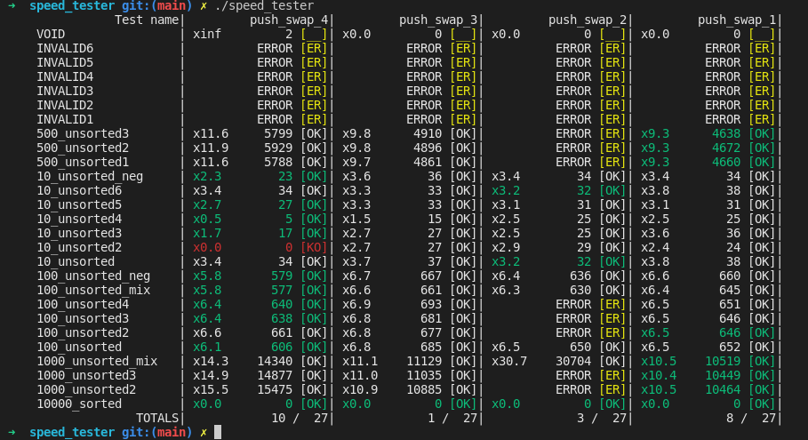

# Push_swap - 42Lisbon

To clone with submodules: `git clone --recursive <project url>`

Sorting with two stacks and basic operations (`swap`, `push`, `rotate`, `reverse rotate`).

## Content
- `push_swap` program *(not ready yet!)*
- `Checker` (to check if the instructions of push_swap gives a sorted stack as result)
- `perm_calc` program to create all possible permutations of n numbers (check dedicated readme page)

## Speed tester
To test 1 or multiple push_swap speeds you can try my speed_tester [here](https://github.com/mikysett/push_swap_speed_tester)

